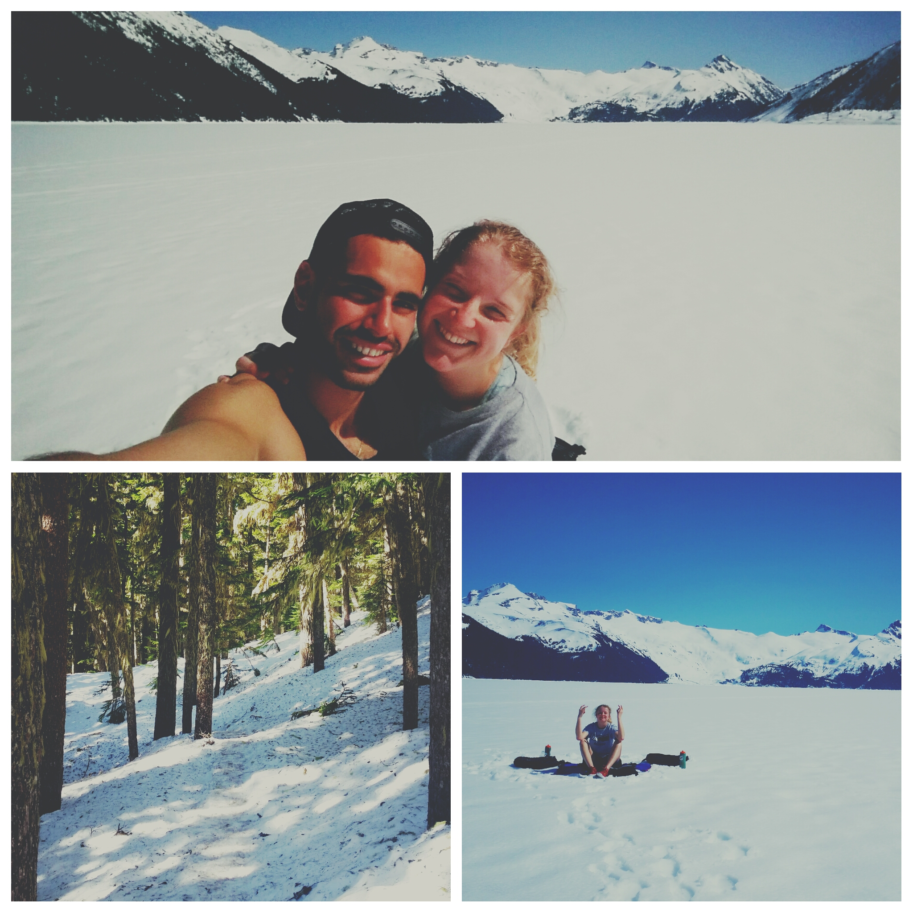

Snow started half way up the trail. We were not prepared, old running shoes, 
shorts and T-shirts. Slipping and falling, we talked about turning back.
Giving up is for the weak.  
We kept going, we started sinking further into the snow, knee deep as the sun
beat down on us, scraping our legs, making them numb.
The sun, and the reflection on the snow made squinting our eyes inevitable and
the sky was a clear deep blue as if clouds never existed. 
For the first time in months I felt a warmth return to the deepest inside of my body 
while laying in the middle of a lake covered in ice and snow. 

Garibaldi Lake, BC. April 7, 2016. 
